# PCAP Hunter

[](https://github.com/ninedter/pcap-hunter/actions/workflows/ci.yml)
[](CHANGELOG.md#300---2026-08-03)
[](https://www.python.org/downloads/)
[](LICENSE)

> **[繁體中文版 README (Traditional Chinese)](docs/zh-TW/README.md)**

**PCAP Hunter** is an AI-enhanced threat hunting workbench that bridges manual packet analysis and automated security monitoring. It gives SOC analysts and threat hunters one place to ingest captures, follow the durable analysis pipeline, review findings, explore linked traffic visualizations, validate ATT&CK hypotheses, enrich indicators, and preserve case evidence.

The latest workbench keeps the full packet-analysis depth of **Zeek**, **Tshark**, and **PyShark**, then adds an analyst-first interface for geographic flow aggregation, cross-filtered traffic views, evidence inventory, OSINT, reports, and optional **Large Language Model (LLM)** assistance. Deterministic evidence remains available even when an LLM or enrichment provider is unavailable.

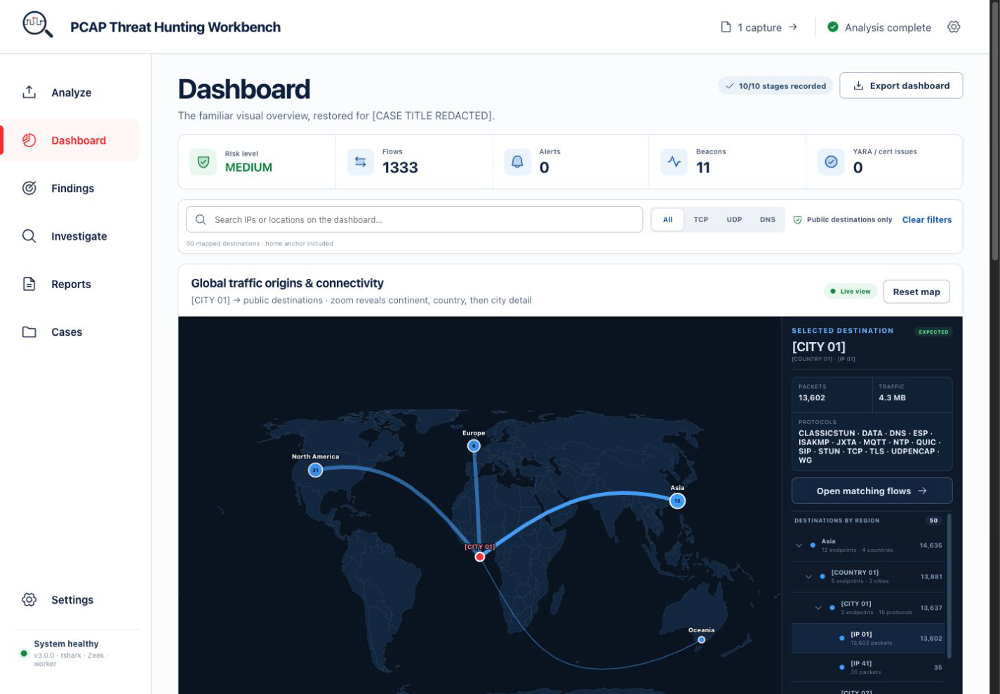

See every current workspace in the [version 3 visual tour](#visual-tour).

> Documentation and design-handoff images use irreversible replacement labels such as `[IP 01]`, `[HOST 01]`, and `[CAPTURE 01]`. Raw addresses, hostnames, case details, capture filenames, secrets, email addresses, local paths, and precise home-location data are never embedded in these files.

📖 **[User Manual (English)](docs/en/USER_MANUAL.md)** | **[中文說明 (Traditional Chinese)](docs/zh-TW/README.md)**

---

## What's new in version 3

- **A new analyst-first workbench** — the production UI is now a responsive React application with clear Analyze, Dashboard, Findings, Investigate, Reports, Cases, and Settings workspaces.
- **A proportioned, scalable world map** — global traffic stays readable as destination volume grows, grouping endpoints by continent, country, and city while preserving every underlying address.
- **Compact destination navigation** — the former flat endpoint list is now an expandable continent → country → city → endpoint hierarchy with the active path opened automatically.
- **Linked visual analysis** — protocol, timeline, search, and map selections share one filter state, so interacting with one visualization updates the other traffic views instead of becoming a visual-only selection.
- **Working visualization shortcuts** — World map, Top IPs and domains, Sankey, network graph, attack timeline, histograms, and heatmap controls now open and focus their real destinations.
- **More room without distortion** — the desktop connectivity panel is taller, the geographic projection scales with it, and responsive layouts retain readable proportions on smaller screens.
- **No hidden investigation text** — protocols, hostnames, identifiers, tables, legends, and chart marks wrap or resize instead of being silently clipped.
- **Durable analysis workflow** — run progress, cases, findings, ATT&CK hypotheses, reports, exports, OSINT, and raw evidence remain connected through a single workbench state.
- **Privacy-safe documentation mode** — an explicit opt-in view replaces addresses, hostnames, case details, filenames, locations, and other sensitive values with irreversible labels for screenshots and design handoffs.
- **Production-ready delivery** — Docker now builds and serves the React workbench directly while retaining the existing Python analysis engine, persistent configuration, OSINT cache, and authenticated integrations API.

---

## Table of Contents

- [What's new in version 3](#whats-new-in-version-3)
- [Visual Tour](#visual-tour)
- [Key Features](#key-features)
- [Integrations API](#integrations-api)
- [Architecture](#architecture)
- [Installation](#installation)
- [Quick Start](#quick-start)
- [Usage Guide](#usage-guide)
- [Configuration](#configuration)
- [Development](#development)
- [Documentation](#documentation)
- [License](#license)

---

## Visual Tour

These captures come from the production version 3 React workbench. Documentation
privacy mode irreversibly replaces addresses, hostnames, case details, capture
filenames, secrets, email addresses, local paths, and precise locations before a
screenshot is saved.

### 1. Analyze — upload, configure, and monitor

Load one capture or a batch, review the ten-stage run profile, choose whether to
generate an AI report, and follow durable background progress from the run queue.

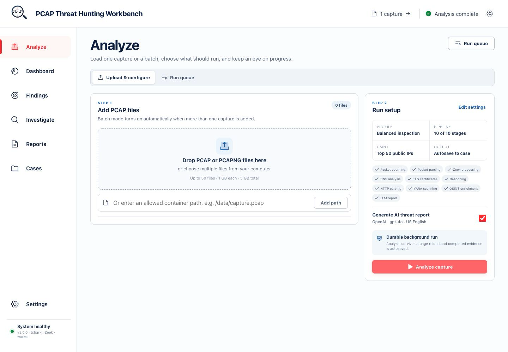

### 2. Dashboard — connected geographic overview

Risk, flows, alerts, beacon candidates, and capture health lead into a larger,
proportioned world map. Destinations group by continent, country, and city while
the expandable region tree preserves every underlying endpoint.


### 3. Findings — verdict and next actions

The findings summary explains the current verdict, keeps pipeline coverage
visible, and provides direct next steps into capture coverage, threat intelligence,
linked traffic, and the saved report.

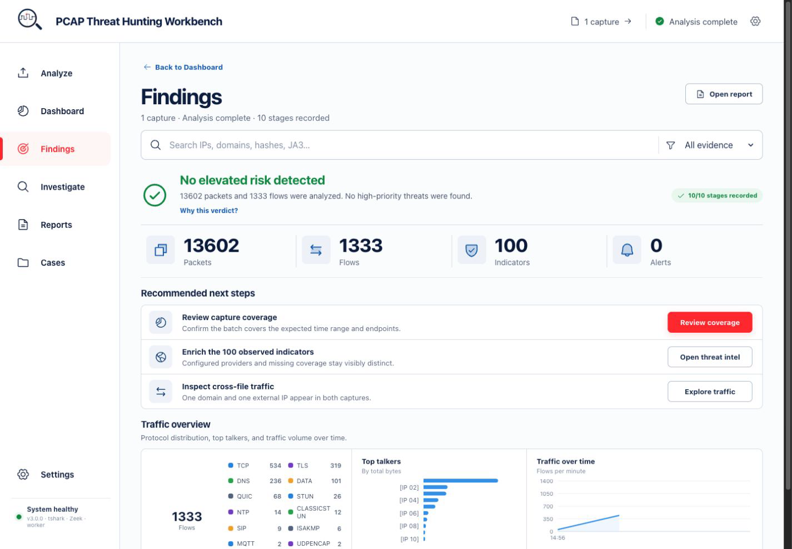

### 4. Evidence — searchable indicator inventory

Search and filter the active batch across IPs, domains, hashes, and fingerprints.
Source capture, context, assessment, reverse-DNS names, WHOIS access, and IOC export
stay together in one inventory.

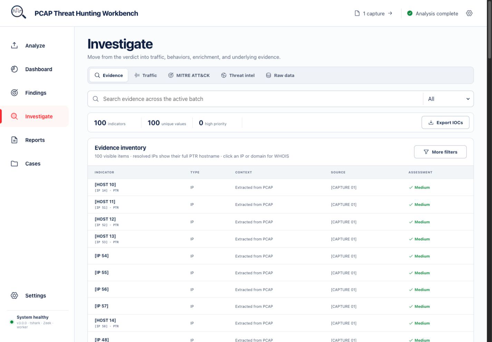

### 5. Traffic — linked visual analysis

Protocol, top-talker, timeline, IP, and time-range selections share one filter
state. The same investigation can continue in the world map, Sankey flow, network
graph, attack timeline, histograms, or heatmap without losing context.

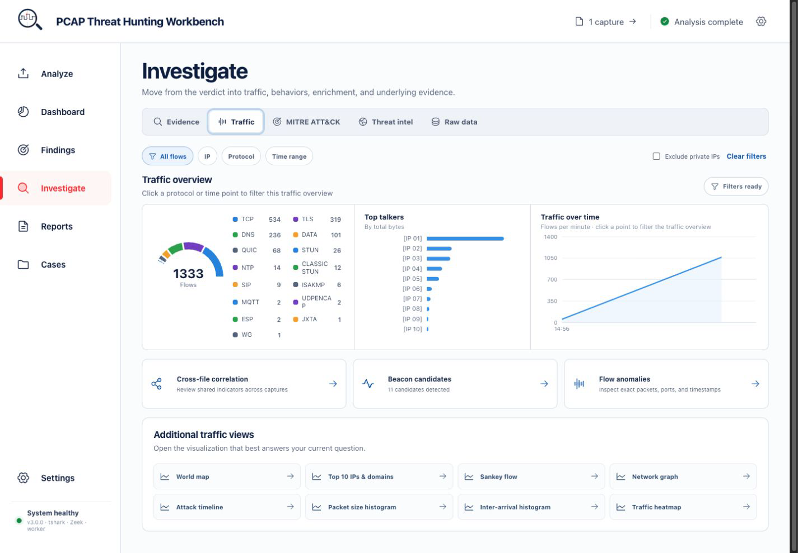

### 6. MITRE ATT&CK — evidence-backed hypotheses

Network observations are presented as ATT&CK hypotheses rather than proof of
endpoint execution. Analysts can review confidence, disposition, coverage gaps,
and exports from the same workspace.

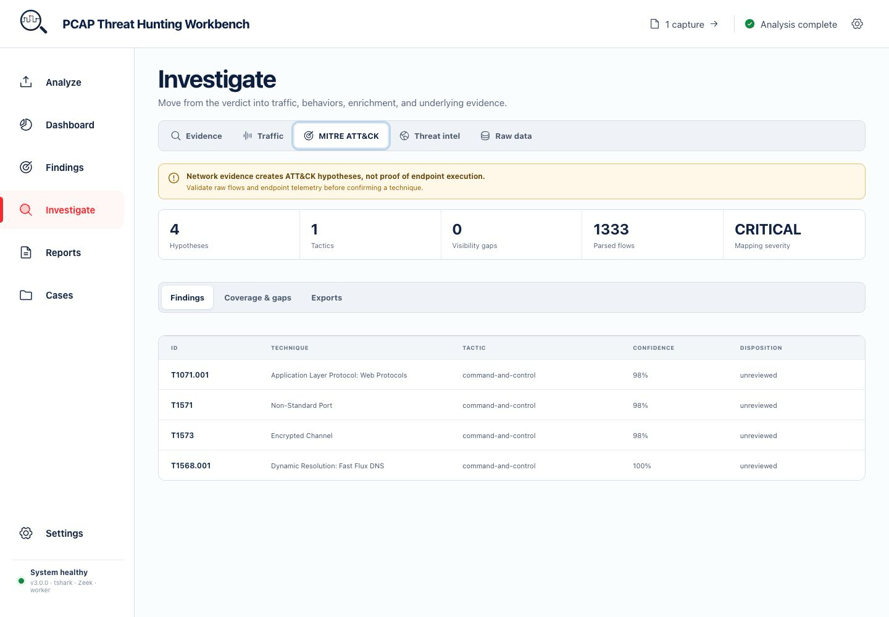

### 7. Threat intelligence — provider-aware IOC triage

VirusTotal, AbuseIPDB, GreyNoise, OTX, and Shodan coverage stays distinct from a
provider returning no data. IP and domain triage retain verdict, ASN, organization,
score, enrichment state, and WHOIS access.

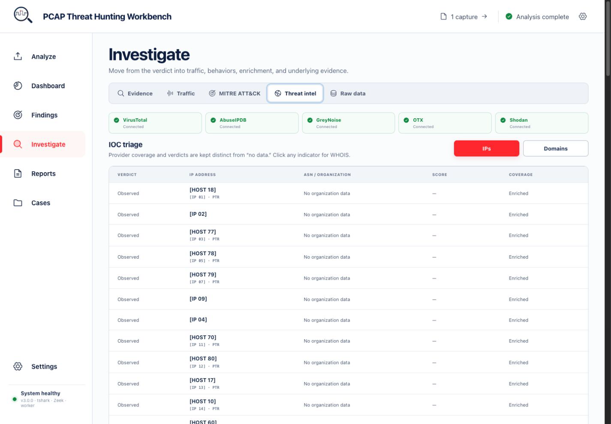

### 8. Raw data — inspect the underlying evidence

Flow, DNS, TLS, JA3/JA3S, Zeek, carved payload, and YARA datasets remain available
with exact timestamps, capture lineage, protocol details, packet counts, and byte
counts.

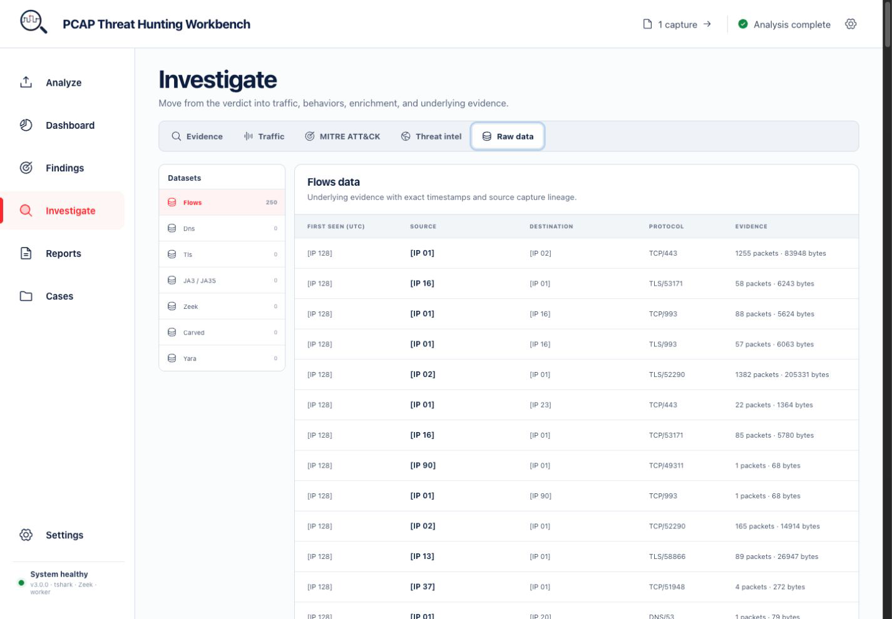

### 9. Reports — narrative and machine-readable handoff

Generate or refresh the optional AI threat report, verify which deterministic
evidence sources were included, download the PDF, and switch to structured export
formats without re-running packet analysis.

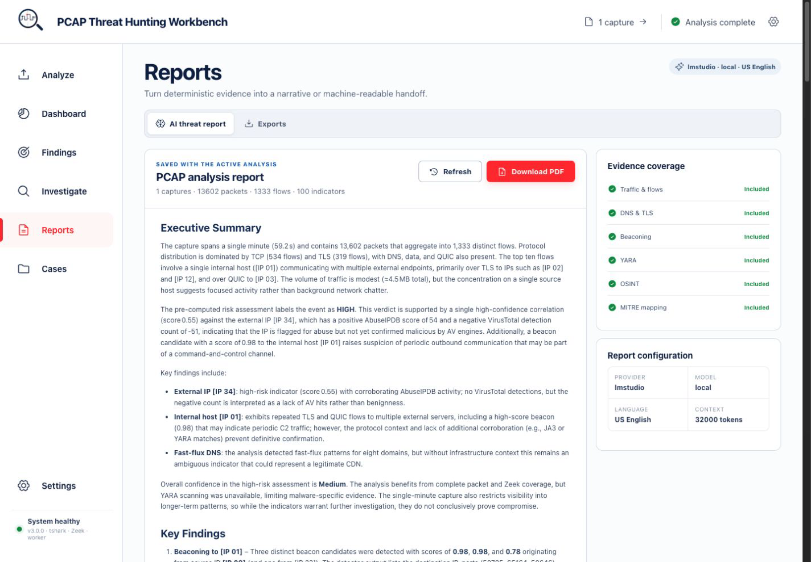

### 10. Cases — persistent investigation tracking

Keep captures, analyses, IOCs, severity, status, tags, and analyst notes together
across sessions. Search existing cases or begin a new analysis directly from the
case workspace.

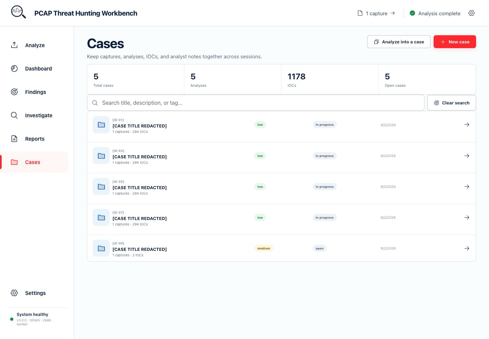

### 11. Settings — one place for runtime configuration

Manage LLM and report options, threat-intelligence providers, pipeline stages,
tools and YARA, map location, API access, retention, and runtime logs. Stored
secrets stay write-only and are encrypted at rest.

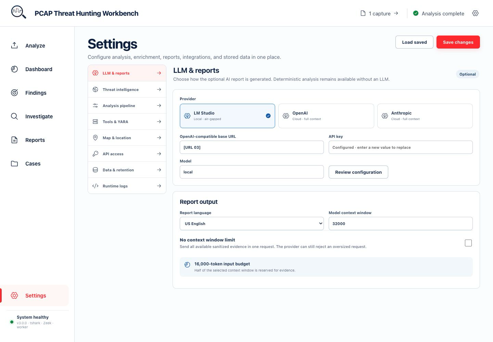

---

## Key Features

### AI-Powered Threat Analysis
- **Multi-Provider LLM Support** — three interchangeable backends under **Settings → LLM & reports**:
  - **LM Studio** (local) — privacy-first, air-gapped friendly; reports are generated section-by-section to fit small context windows.
  - **OpenAI** (cloud) — single-shot report with the entire evidence corpus in one full-context call.
  - **Anthropic** (cloud) — Claude via the official `anthropic` SDK (`claude-opus-4-8`, `claude-sonnet-4-6`, `claude-haiku-4-5`), single-shot with streaming.
- **Configurable Context Budget** — select a 10K–1M-token model window with a conservative 50% input ceiling, or explicitly enable unlimited mode to send all sanitized evidence at once.
- **Evidence-Grounded Reporting** — SOC-ready reports with severity-calibrated assessments, false-positive awareness, confidence qualifiers, a Risk Matrix rendered as a real Markdown table, and an IOC Summary table.
- **LLM-Optional Evidence View** — parsed packet, flow, IOC, correlation, stage, and warning evidence remains visible when generation is skipped or the provider is unavailable.
- **Multi-Language Reports** — 9 languages with region-specific terminology: English, Traditional Chinese (Taiwan), Simplified Chinese, Japanese, Korean, Italian, Spanish, French, German.
- **MITRE ATT&CK Analysis** — A separate Behaviors & Coverage workspace that maps network evidence to versioned ATT&CK hypotheses, links applicable Detection Strategies/Data Components, records analyst dispositions, and exports Navigator layers.
- **Capture-quality telemetry** — Packet/flow scale, parse coverage, time window, sampling limits, pipeline warnings, and detector visibility gaps are recorded alongside findings.
- **Attack Narrative Synthesis** — Translates raw events into a coherent, actionable security story.

### IOC Priority Scoring
- **Tiered Signal Architecture** — Dynamically ranks indicators as Critical, High, Medium, or Low using a three-tier model:
  - **Tier 1 (Definitive)**: OSINT confirmations (VirusTotal, GreyNoise malicious) — any single Tier 1 hit sets a score floor.
  - **Tier 2 (Behavioral)**: C2 beaconing, flow asymmetry, DNS tunneling, DGA domains.
  - **Tier 3 (Contextual)**: AbuseIPDB, self-signed certs, expired certs, YARA matches.
- Tier 3 signals alone never exceed "medium"; corroboration from multiple tiers is required for "high" or "critical".
- **Explainable Risk** — the Dashboard's "Why this risk level?" expander shows exactly which signals drove the verdict.

### Cross-Indicator Correlation Engine
- **Independence-complement formula** — Uses `1 − Π(1 − wᵢsᵢ)` (Bayesian independence model) instead of linear summation, producing diminishing returns while allowing multiple weak signals to compound meaningfully.
- **Strong-signal floors** — A confirmed VirusTotal detection automatically sets a minimum score regardless of other factors.
- Aggregates signals across all analysis modules (OSINT, beaconing, DNS, TLS, YARA, flow analysis).
- Produces composite threat scores per indicator with verdict classification (critical / high / medium / low).

### Flow Analysis & Exfiltration Detection
- **Data Exfiltration Detection** — Identifies suspicious outbound:inbound byte ratios per src/dst pair (default threshold: 10:1, minimum 1 MB).
- **Port Anomaly Detection** — Flags non-standard port usage, C2 common ports (4444, 5555, 6666, etc.), and high port pairs.
- **Memory-Bounded Sampling** — per-flow packet timestamps/lengths are capped at 5,000 samples while true byte/packet totals and first/last-seen times are kept exact.

### Multi-PCAP Batch Processing
- **Multi-File Upload** — Upload and analyze multiple PCAP files simultaneously.
- **Validated Streaming Intake** — `.pcap` and `.pcapng` uploads are written in bounded chunks, checked for file and batch limits, validated by magic bytes, and rolled back as a set after any failure.
- **Cross-File Correlation** — Detects shared IPs, domains, and JA3 fingerprints across files.
- **Merged Dashboard** — Aggregated results with per-file detail cards and batch summary.
- **Resource Limits** — Configurable limits: 1 GB per file, 50 files max, 5 GB total.

### Concurrent Pipeline Execution
- **PyShark + Zeek in parallel** — the two heaviest stages run concurrently via ThreadPoolExecutor.
- **Four-way analysis fan-out** — after the parse join, DNS, TLS, beaconing, and HTTP carving all run concurrently.
- **Per-run artifact isolation** — Zeek and carve outputs go to `data/zeek|carved/<case>_<uuid8>/` so concurrent runs never clobber each other; stale run dirs are pruned automatically after 7 days.
- **Bounded subprocesses** — every external tool call (zeek, tshark counting/carving/TLS extraction) runs under an explicit timeout.
- **Tshark `-c` optimization** — packet limit enforced at the tshark level for zero-waste I/O.

### Deep Packet Inspection & Flow Analysis
- **Multi-Engine Pipeline**: PyShark for granular inspection, Tshark for high-speed statistics.
- **Protocol Parsing**: Automatically extracts metadata for HTTP, DNS, TLS/SSL, and SMB protocols.

### Zeek Integration
- Automated Zeek execution on uploaded PCAPs — no manual CLI required.
- Parses and correlates core Zeek logs: `conn.log`, `dns.log`, `http.log`, `ssl.log`.

### Advanced DNS & TLS Forensics
- **DGA Detection** — Shannon entropy-based Domain Generation Algorithm identification.
- **DNS Tunneling** — Detects high-volume / anomalous DNS payloads.
- **Fast Flux Detection** — Identifies domains resolving to rapidly changing IP addresses.
- **JA3/JA3S Fingerprinting** — Matches TLS fingerprints against 90+ known malware signatures (Cobalt Strike, Trickbot, Emotet, QakBot, etc.).
- **Certificate Analysis** — Validates certificate chains; detects self-signed and expired certificates.

### C2 Beaconing Detection
- Statistical algorithm scoring flows based on:
  - **Periodicity** — Regularity of communication intervals (CV + entropy scoring).
  - **Jitter** — Modal interval analysis with ±20% tolerance for detecting randomized C2.
  - **Volume** — Packet count and payload size consistency.
- **False-Positive Reduction** — Multi-layered penalties to prevent benign traffic from triggering alerts:
  - Infrastructure allowlist (major public DNS resolvers)
  - Protocol awareness (ICMP, NTP, mDNS, SSDP, IGMP are inherently periodic)
  - Service port penalties (HTTPS, IMAPS, Apple Push, MQTT, SIP)
  - High-volume large-payload filtering (streaming/downloads vs. C2)

### Payload Carving & YARA Scanning
- **HTTP Payload Extraction** via `tshark` with automatic SHA256 hashing.
- **YARA Rules Config** — point **Settings → Tools & YARA** at any rules directory (scanned recursively); zero-config default is `data/yara_rules/` when present.
- **Safe Storage** — quarantined per-run directory with path traversal and symlink protection.

### Honest, Analyst-First UI
- **Central severity color system** — one palette drives every verdict badge, chart, and pill, with a one-line legend for calibration.
- **Honest provider status** — OSINT provider pills distinguish OK / cached / rate-limited / key-rejected / no-data instead of a generic error, aggregated across all queried indicators; **Settings → Threat intelligence** can live-check each configured provider.
- **Contextual empty states** — panels distinguish "ran clean" from "stage skipped/failed"; nothing renders as a silent blank.
- **Humanized tables** — UTC-labelled timestamps, progress-bar score columns, named chart axes.
- **Cross-Filtering** — unified drill-down across Map, Protocol Pie Chart, and Flow Timeline; "Exclude Private IPs" persists during exploration.
- **TopN Charts** — top IPs, ports, protocols, domains with reverse-DNS hostnames.
- **World Map** — threat-level coloring, connectivity arcs with volume-based thickness, configurable home location.

### OSINT Enrichment
Integrates with leading threat intelligence providers:
- **VirusTotal** — File hash and IP/Domain reputation.
- **AbuseIPDB** — Crowdsourced IP abuse reports.
- **GreyNoise** — Internet background noise and scanner identification.
- **OTX (AlienVault)** — Open Threat Exchange pulses and indicators.
- **Shodan** — Internet-facing device details and open ports.
- **Smart Caching** — SQLite-backed caching with configurable TTL to preserve API quotas.
- **Bulk Reverse DNS** — Parallel rDNS resolution for all public IPs with 7-day SQLite cache.
- **WHOIS Lookup** — on-demand WHOIS dialog for any listed IP, via row-click or an explicit selectbox + button.

### Case Management System
- Create, track, and close investigation cases.
- Store IOCs (IP, Domain, Hash, JA3, URL) with severity and context.
- Persist ATT&CK hypotheses and capture-quality metrics with each analysis.
- Replace stale IOC rows cleanly when an existing analysis is re-saved.
- Investigation notes, tag-based organization, and search.

### Professional PDF Export
- Multi-page PDF reports with executive summary, key findings, technical analysis, and recommendations.
- **Self-consistent section registry** — section numbering and the table of contents are generated from one registry, so they always agree; LLM-authored headings are demoted below section level.
- **Risk Matrix & IOC Summary** — rendered as real tables in the PDF, not prose.
- **Embedded dashboard charts** — protocol distribution, top talkers, flow timeline, network graph, world map — rendered to PNG via kaleido for static handoff.
- **Timezone-aware timestamps** plus configurable TLP classification and analyst metadata.

### Export Formats
- **CSV / JSON** — Export any data table with CSV injection protection.
- **STIX 2.0/2.1** — Export indicators in standard STIX format.
- **ATT&CK Navigator** — Export technique mappings for MITRE ATT&CK Navigator.
- **CEF (ArcSight)** — SIEM-ingestible events from correlations, beacons, DNS, and IOCs.

---

## Integrations API

PCAP Hunter ships a FastAPI-based REST API alongside the production React workbench so SOAR
platforms, SIEM systems, and custom scripts can submit PCAPs, poll job progress,
retrieve cases/PDF reports, and pull IOC feeds (JSON / CSV / STIX 2.1)
programmatically. It reuses the same 10-stage pipeline, SQLite case database, and
configuration as the UI; DB-backed API keys are managed under **Settings → API access**.
Headless results include capture-quality metrics and ATT&CK hypotheses, while IOC
feeds include the technique IDs associated with contributing analyses. Uploads are
streamed and validated before queueing; queue or persistence failures remove the
provisional file and case instead of leaving orphans.

```bash
make run-api     # http://localhost:8000
make smoke-api   # end-to-end smoke test against the local API
```

> Endpoint reference, authentication, curl examples, and SIEM integration guides:
> **[docs/API.md](docs/API.md)** and **[docs/api/README.md](docs/api/README.md)**

---

## Architecture

```
app/
├── analysis/        # Correlation, flow/IOC scoring, narration, capture visibility
├── api/             # FastAPI integrations API (REST endpoints, auth, key mgmt)
│   ├── routers/     # health, pcaps, jobs, cases, iocs, admin
│   ├── key_auth.py  # DB + env-var authentication pipeline
│   ├── key_repository.py  # SQLite API key store
│   ├── rate_limiter.py    # Sliding-window per-key rate limiter
│   └── queue.py     # Background pipeline execution (ProcessPoolExecutor)
├── database/        # Case management (SQLite)
├── llm/             # LLM client + multi-provider dispatch (providers.py)
├── pipeline/        # 10-stage analysis pipeline
│   ├── runner.py    # Headless orchestrator (parallel stages, per-run dirs)
│   ├── beacon.py    # C2 beaconing detection
│   ├── carve.py     # HTTP payload carving
│   ├── dns_analysis.py  # DGA, tunneling, fast flux
│   ├── geoip.py     # GeoIP resolution
│   ├── ja3.py       # JA3/JA3S fingerprinting
│   ├── batch.py     # Multi-PCAP batch processing & correlation
│   ├── osint.py     # OSINT provider queries (parallel)
│   ├── osint_cache.py   # SQLite OSINT caching layer
│   ├── rdns_cache.py    # SQLite reverse-DNS caching layer
│   ├── tls_certs.py # Certificate validation
│   └── yara_scan.py # YARA rule scanning
├── reports/         # PDF report generation (WeasyPrint + kaleido charts)
├── security/        # OPSEC hardening & data sanitization
├── threat_intel/    # MITRE ATT&CK mapping
├── web/             # Production FastAPI UI service + React static assets
├── ui/              # Legacy Streamlit interface retained for standalone use
├── utils/           # Export, GeoIP, config, binary discovery, CEF
├── config.py        # Application defaults
└── main.py          # Legacy Streamlit entry point

prototype-friendly-ui/
├── src/             # React 19 workbench, linked filters, maps, and privacy mode
├── worker/          # Frontend worker entry point
└── vite.config.mjs  # Production frontend build
```

### Analysis Pipeline (10 Stages)

1. **Packet Counting** — Fast preliminary count via tshark
2. **Packet Parsing** — Deep inspection up to 200,000 packets (configurable)
3. **Zeek Processing** — Automated Zeek execution and log parsing
4. **DNS Analysis** — DGA, tunneling, fast flux, NXDOMAIN, query velocity
5. **TLS Certificate Analysis** — Chain validation, self-signed/expired detection
6. **Beaconing Ranking** — Temporal pattern analysis for C2 detection
7. **HTTP Carving** — Payload extraction with SHA256 hashing
8. **YARA Scanning** — Rule-based file scanning
9. **OSINT Enrichment** — Multi-provider reputation lookup
10. **LLM Report Generation** — AI-powered threat synthesis

Stages 2–3 (PyShark, Zeek) run in parallel; after that parse join, stages 4–7
(DNS, TLS, beaconing, carving) run concurrently. Zeek and carve write into
per-run output directories (`data/zeek|carved/<case>_<uuid8>/`) so concurrent
runs never clobber each other; stale run dirs are pruned after 7 days.

---

## Installation

### Option A — Docker (recommended)

The canonical build-and-verify path. The image bakes in tshark, zeek, the
WeasyPrint libraries, and all Python deps — nothing to install on the host but
Docker itself.

```bash
git clone https://github.com/ninedter/pcap-hunter.git
cd pcap-hunter
make docker-up        # build + start the UI → http://localhost:8501
make docker-verify    # format + lint + full test suite INSIDE the image
make docker-down      # stop compose services
```

Compose notes:

- `./data` is mounted into the container, so PCAPs, carved files, Zeek logs, and
  the case database live on the host. Put YARA rules under `./data/yara_rules`.
  Set `PCAP_HUNTER_DATA_BIND` to use a different host data directory.
- API keys saved in the UI persist in the `pcap-hunter-home` volume; the compose
  file pins `hostname:` so the config encryption key stays stable across
  container recreation.
- LM Studio running on the host is reachable from the container —
  `LM_BASE_URL` defaults to `http://host.docker.internal:1234/v1`.
- A second compose service (`pcap-hunter-api`) serves the Integrations API on
  port 8000 from the same image.

### Option B — Standalone install

All install logic lives in a single cross-platform script
(`scripts/install.py`) that detects your OS and package manager, installs
system binaries and Python packages, then verifies everything.

```bash
git clone https://github.com/ninedter/pcap-hunter.git
cd pcap-hunter
python3 scripts/install.py
make run              # → http://localhost:8501
```

What it installs per platform:

| Platform | Manager | System packages |
|----------|---------|-----------------|
| macOS | `brew` | `wireshark` (tshark + capinfos), `zeek`, `yara`, and `pango` + `glib` + `cairo` for WeasyPrint PDF export |
| Linux | `apt-get` | `tshark`, `zeek`, `yara`, `libpcap0.8`, and the WeasyPrint runtime libs (`libpango-1.0-0`, `libpangocairo-1.0-0`, `libpangoft2-1.0-0`, `libharfbuzz0b`, `libcairo2`, `libgdk-pixbuf-2.0-0`, `shared-mime-info`, `fonts-dejavu-core`); non-apt distros get manual hints (dnf/pacman) |
| Windows | `winget` → `choco` → `scoop` | Wireshark (winget/choco/scoop), YARA (choco/scoop); Zeek has no native Windows build — the installer points you to WSL2 or Docker |

It then pip-installs `requirements.txt` (no separate Chromium needed — the
pinned `kaleido==0.2.1` bundles its own headless renderer) and runs the
dependency checker. Required Python packages are verified by name (streamlit,
pandas, numpy, pyshark, scapy, openai, anthropic, requests, cryptography,
plotly, kaleido, markdown, jinja2, fastapi, uvicorn); `weasyprint` and
`yara-python` are checked as optional — the app degrades gracefully without
them.

Prefer your platform's usual workflow? These wrappers all delegate to the same
`install.py`:

| Platform | Command |
|----------|---------|
| macOS / Linux | `make install` |
| Windows (PowerShell) | `.\scripts\install.ps1` (bootstraps Python first, then delegates) |
| Any platform | `python3 scripts/install.py` |

### Installer flags

```
python3 scripts/install.py              # full install + verification
python3 scripts/install.py --check-only # just run the dependency checker
python3 scripts/install.py --skip-system # pip only
python3 scripts/install.py --skip-python # system binaries only
python3 scripts/install.py --dry-run    # preview commands without executing
python3 scripts/install.py --yes        # non-interactive (assume yes)
```

### Windows notes

**Zeek has no native Windows build.** Native Windows installs will work for the
tshark pipeline but skip the Zeek protocol-analysis stage. For the complete
pipeline on Windows, use:

- **Docker** (simplest) — `make docker-up` or `docker compose up --build`
- **WSL2** — `wsl --install -d Ubuntu`, then run `python3 scripts/install.py` inside Ubuntu

### Verifying your install

```bash
make doctor                              # macOS / Linux
python3 scripts/install.py --check-only  # any OS (including Windows)
```

The app also runs this check at startup and shows a red banner at the top of every
page if any required binary is missing — you'll never get a silently empty dashboard.

---

## Quick Start

```bash
make docker-up   # Docker (recommended) → http://localhost:8501
# — or —
make run         # standalone, after python3 scripts/install.py
```

Open `http://localhost:8501` in your browser.

---

## Usage Guide

1. **Upload** — In **Analyze → Upload & configure**, drag in one or more `.pcap` / `.pcapng` files or add an allowed container path. Multiple files automatically enable batch correlation.
2. **Configure** — Use **Settings** to choose an LLM provider, home location, OSINT providers, YARA rules, pipeline stages, API access, and retention policy.
3. **Analyze** — Review the run setup and click **Analyze capture**.
4. **Monitor** — Open **Analyze → Run queue** while the durable background process executes Packet Counting > Parsing + Zeek (parallel) > DNS / TLS / Beaconing / Carving (concurrent) > YARA > OSINT > LLM Report. Reloading the page does not discard the job.
5. **Review** — Move from Dashboard and Findings into Evidence, Traffic, MITRE ATT&CK, Threat intelligence, Raw data, Reports, and Cases.
6. **Export** — Download CSV/JSON data, PDF reports, STIX bundles, ATT&CK Navigator layers, or CEF syslog events.

### Re-run Reports

Changed your LLM provider, model, or report language? Open **Reports** and click **Refresh** to regenerate only the AI report without re-processing the entire PCAP.

### Data Management

Use **Settings → Data & retention** to independently manage PCAP data, OSINT cache, and the Cases database.

---

## Configuration

- Defaults in `app/config.py` (thresholds, paths, URLs)
- Persistent config in `~/.pcap_hunter_config.json` (managed by `ConfigManager`)
- API keys encrypted at rest with machine-derived PBKDF2 key
- Environment-variable overrides: `OTX_KEY`, `VT_KEY`, `SHODAN_KEY`, etc.
- LLM defaults: LM Studio at `http://localhost:1234/v1`
- YARA rules: leave the directory blank to use `data/yara_rules/` when present

### Key Thresholds

| Setting | Default | Purpose |
|---------|---------|---------|
| DGA entropy | 4.0 bits | Shannon entropy threshold for DGA detection |
| Fast flux | 10+ IPs | Minimum distinct IPs per domain |
| Flow asymmetry | 10:1 + ≥1 MB | Exfil candidate threshold |
| C2 common ports | 4444, 5555, 6666, 7777, 8888, 9999, 1337, 31337 | Port-anomaly match list |
| PyShark limit | 200,000 packets | Deep-parse cap |
| Flow sample cap | 5,000 per flow | Sampled timestamps/lengths (true totals kept exact) |
| Run-dir retention | 7 days | Per-run `data/zeek\|carved/` dirs pruned on the next run |
| Subprocess timeouts | zeek 600 s; count 120 s; carve / TLS extract 300 s | Bounded external tool calls |

---

## Development

### Pre-commit gate — `make verify`

```bash
make verify     # format check + lint + full test suite
```

Required before every commit. CI (GitHub Actions, Python 3.11) runs the same
checks on every push/PR to `main`. For build-shaped verification (dependency
changes, install paths, release checks) use `make docker-verify` — it runs the
identical gate inside the runtime image, independent of the host Python setup.

### Make targets

| Target | What it does |
|--------|--------------|
| `make install` | Full install (system + python) + verification |
| `make install-system` / `make install-python` | System binaries only / Python packages only |
| `make check-deps` / `make doctor` | Verify all dependencies are present |
| `make run` | Start the app (checks deps first) |
| `make test` | Run the test suite with coverage |
| `make test-pdf` | Focused PDF + charts test suite |
| `make verify` | Pre-commit gate: format + lint + full tests |
| `make lint` / `make format` | Ruff check / Ruff format |
| `make clean` | Remove caches |
| `make docker-build` | Build the runtime image (`pcap-hunter:latest`) |
| `make docker-up` | Build + start the UI container on :8501 |
| `make docker-down` | Stop compose services |
| `make docker-verify` | Format + lint + full tests inside the image |
| `make run-api` / `make run-api-dev` | Start the Integrations API on :8000 (dev adds --reload) |
| `make smoke-api` | End-to-end smoke test against the local API |
| `make fix-permissions` | Grant macOS BPF capture permissions |

### Regenerating doc screenshots

The current README tour is captured from the real Docker-hosted React workbench
with documentation privacy mode enabled. That mode replaces IP addresses,
hostnames, case details, capture filenames, secrets, email addresses, local paths,
and precise locations in the application before pixels are captured.

```bash
DOCS_DATA="$(mktemp -d)"
cp data/sample.pcap "$DOCS_DATA/sample.pcap"
PCAP_HUNTER_DATA_BIND="$DOCS_DATA" make docker-up
# Capture each visual-tour route with ?privacy=1 at 1440 × 1000.
```

The isolated bind prevents local cases, keys, cache entries, or prior captures
from appearing in the documentation. Verify every file in
`docs/images/workbench-v3/` visually and run the repository's sensitive-value
checks before committing it. `scripts/capture_screenshots.py` remains available
for the legacy Streamlit user-manual image set.

### Testing discipline

PCAP Hunter uses **production-shape test data**, not simplified inputs. See `tests/test_pdf_integration.py` for the canonical pattern — real `CorrelationSignal` dataclasses, real pandas DataFrames, and the nested dict shapes the pipeline actually produces. When adding a new PDF section or chart, extend the corresponding integration test.

---

## Documentation

- **[User Manual (English)](docs/en/USER_MANUAL.md)** — end-user guide
- **[使用手冊 (Traditional Chinese)](docs/zh-TW/USER_MANUAL.md)** — 繁體中文使用手冊
- **[Integrations API Reference](docs/API.md)** — REST endpoints, authentication, configuration
- **[API Integration Guides](docs/api/README.md)** — SIEM / SOAR integration recipes
- **[中文說明 (Traditional Chinese README)](docs/zh-TW/README.md)** — 繁體中文版

---

## License

[MIT License](LICENSE) — see file for details.
